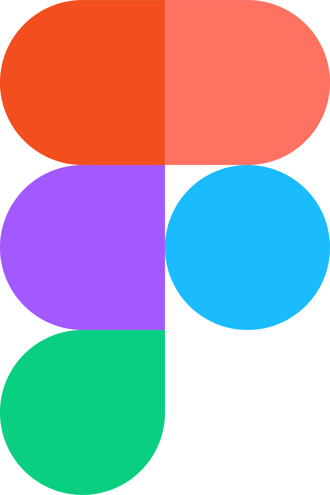

<h2 align="center">Hey Hey, I'm SkaiYoh! 👋</h2>

### 👨‍💻 About Me
- 📽️ Currently working on **~~Super Secret Project~~** 🤭  
- 🦆 Learning more about **Web Development & Computer Programming**  
- 👯 Collaborating with awesome developers 😉  
- 💬 Feel free to check out my projects (but please don’t DM me directly 😅)  
<!-- - 📬 Contact: <a href="https://discord.gg/skaiyoh">discord.gg/skaiyoh</a> -->
<!-- - ⚡ Fun fact: I'm Miata gang 🚗 -->

---

<h3 align="center">🔭 Tech I’m Currently Working With</h3>

  
  
   
  
  

---

<h3 align="center">🌱 Currently Learning</h3>

  
  

---

<h3 align="center">💬 Tools & Platforms I Use</h3>

 
 
 

