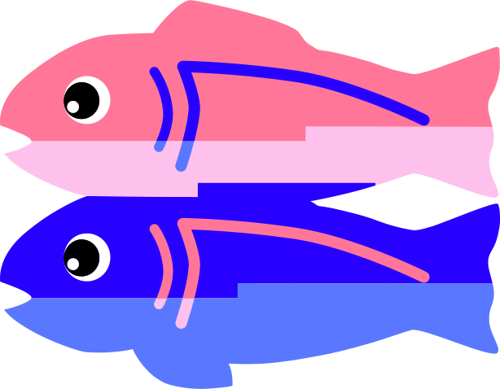
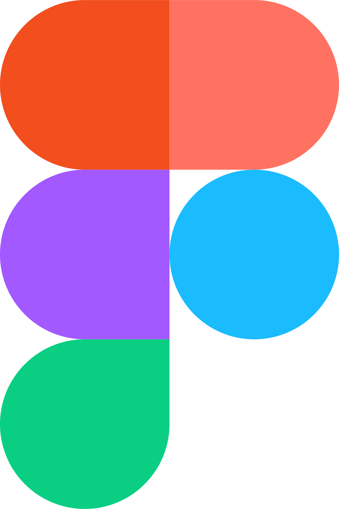

  

  

 

---

### 🧑‍💻 About Me

- 🎯 Dreaming of becoming a **Software Engineer** — one project at a time
- 🌐 Passionate about **web development & design** — love making things look and work great
- 🤖 Fascinated by **AI & machine learning** and where it's all heading
- 🔩 Enjoy diving into **hardware-level projects** — the closer to the metal, the better
- 🗂️ Always juggling **multiple projects** across different domains
- 💬 Feel free to explore my repos!

---

### 💪 Languages I Know Well

  

---

### 🔭 Currently Working With

  

---

### 🌱 Currently Learning

  

---

### 🛠️ Tools & Environment

  

   
  
  &nbsp;
  
  &nbsp;
  

---

### 📊 GitHub Stats

  
  

  

---

  

